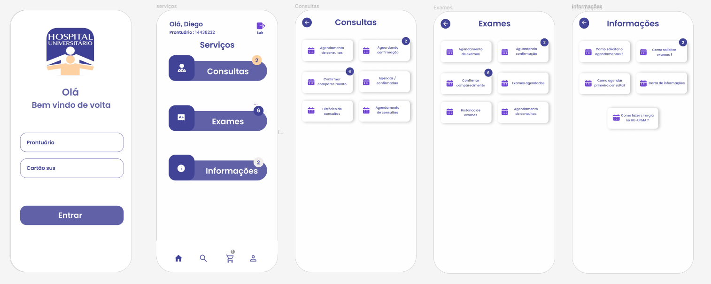

# hu-ufma


## Getting Started

First, run the development server:

```bash
npm start
# or
yarn start
# or
pnpm start
```


## Sobre o APP

Essa aplicação é uma app de marcação de consultas e exames do hospital universitário (Hu-UFMA).
Basicamente uso o app constantemente e vi nele a possibilidade de melhoras. O aplicativo ainda está em DESENVOLVIMENTO.




## 🚀 TECNOLOGIAS UTILIZADAS:

- [x] REACT NATIVE
- [x] EXPO
- [x] TAILWINDCSS


## 🤝 Colaborador

A seguinte pessoa Contribuiu para este projeto:

- Diego DEV

Feito com ♥ by -Diego costa


